# Radar-Based Indoor Occupancy Mapping on a UAV

**Temporal filtering and system integration for 4D automotive radar on embedded platforms**

[](https://docs.ros.org/en/humble/)
[](https://www.nvidia.com/en-us/autonomous-machines/embedded-systems/jetson-orin/)

*Kartik Dangi · March 2026*

</div>

---

<div align="center">
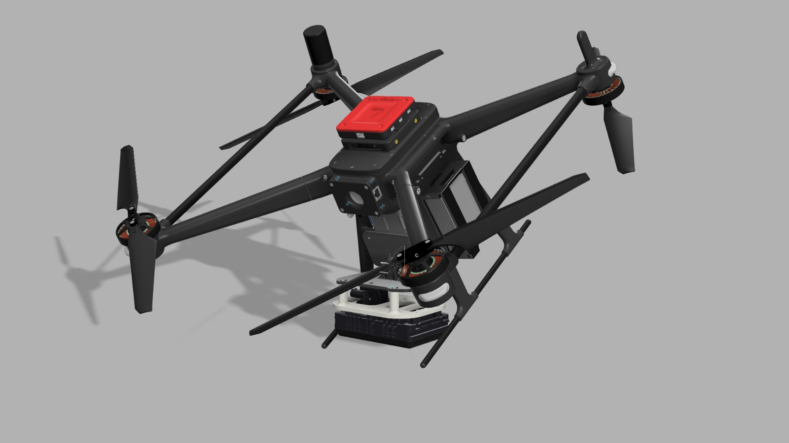

*UAV with 4D automotive radar + Ethernet media converter*
</div>

---

## What This Is

A ROS 2 system that turns a **4D automotive radar** into a real-time indoor mapping tool on a UAV — no GPS, no camera, no LiDAR map. Works in smoke, darkness, and GPS-denied environments.

### Key Features

| | |
|---|---|
| **Fused Odometry** | Madgwick IMU + RANSAC Doppler + LiDAR height → 50 Hz |
| **Radar SLAM** | GICP scan matching + loop closure for drift correction |
| **Temporal Occupancy Grid** | Bayesian log-odds with occlusion filtering + temporal decay |
| **Embedded Real-Time** | ~150 ms full pipeline latency on Jetson Orin NX |

Automotive radar operating at 77 GHz penetrates smoke, dust, and darkness — conditions that cause cameras and LiDARs to fail. It also provides per-point Doppler velocity, enabling ego-motion estimation without any visual features.

---

## System Architecture

<div align="center">
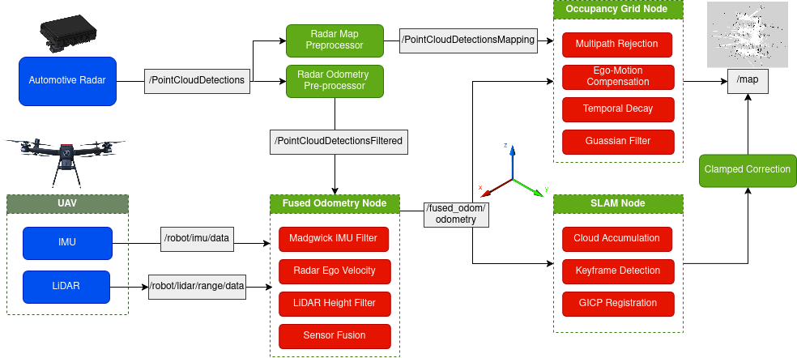
</div>

Two parallel preprocessing paths share the same radar hardware:

```
4D Radar ──┬──→ Odometry Path  (40° FoV, −20 dB RCS)  →  GICP SLAM + Loop Closure
           └──→ Mapping Path   (70° FoV,  −4 dB RCS)  →  Temporal Occupancy Grid
```

<div align="center">
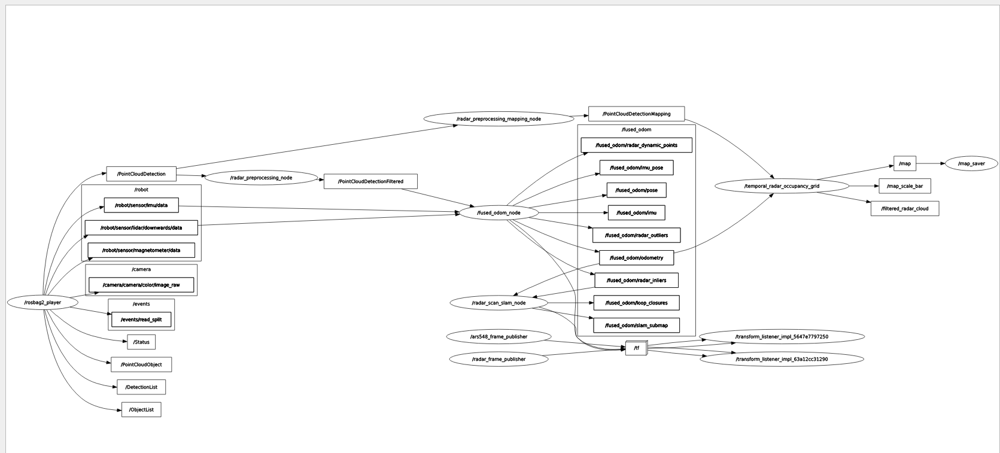

*Live ROS 2 node graph*
</div>

---

## SLAM Pipeline

<div align="center">
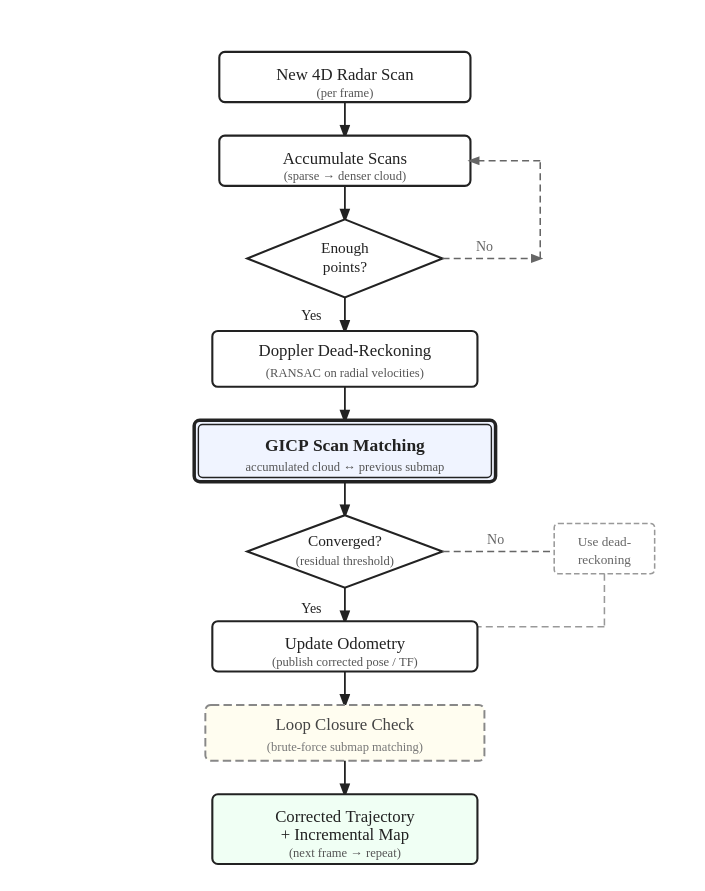
</div>

---

## Results

### Room Experiment (40 m²)

<div align="center">

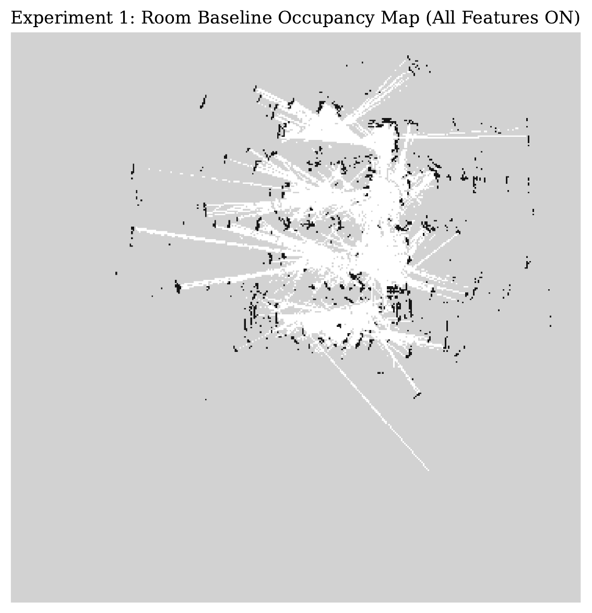
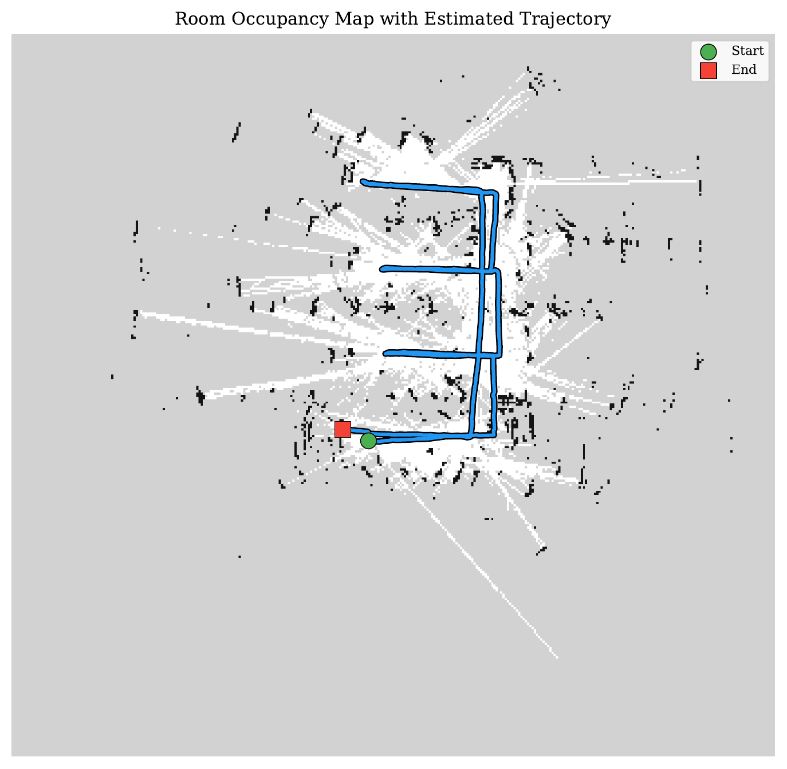

*Generated occupancy map (7 cm resolution) and flight trajectory overlay*
</div>

### Corridor Experiment (2 laps, ~25 m)

<div align="center">

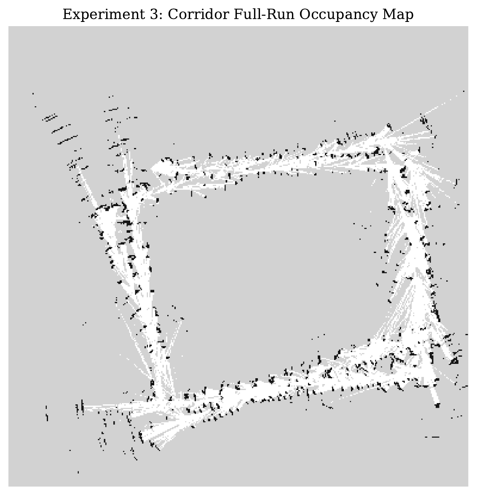
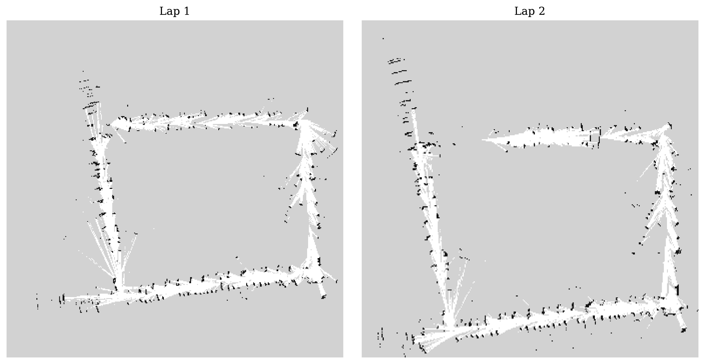

*Corridor occupancy map and lap-over-lap drift analysis*
</div>

### Occlusion Filtering

<div align="center">
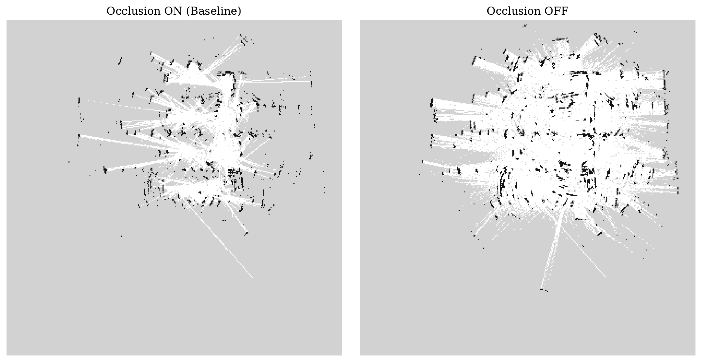

*Per-ray occlusion filtering removes phantom occupancy behind detected surfaces*
</div>

### Performance on Jetson Orin NX

<div align="center">

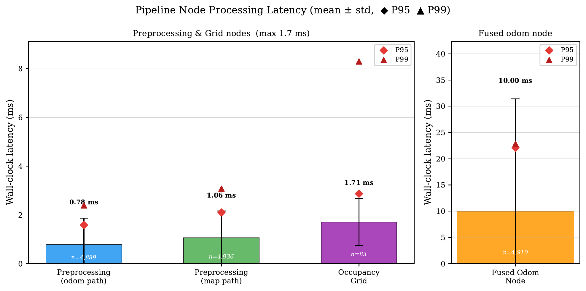
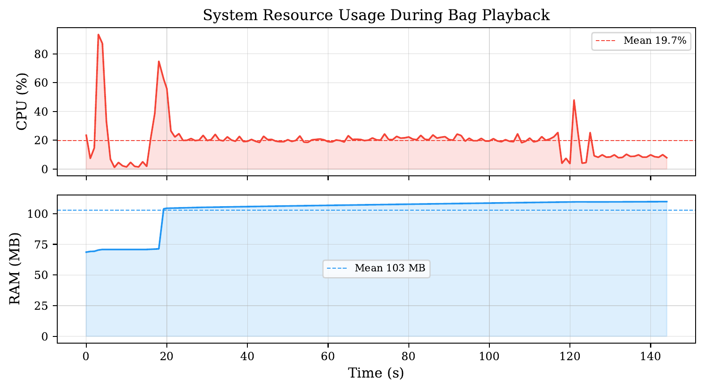

*~150 ms end-to-end latency; sustained operation well within embedded hardware limits*
</div>

---

## Hardware

<div align="center">

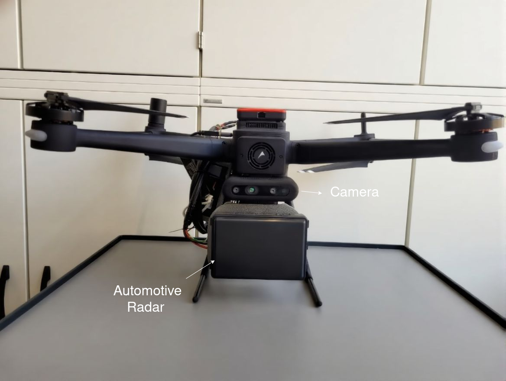
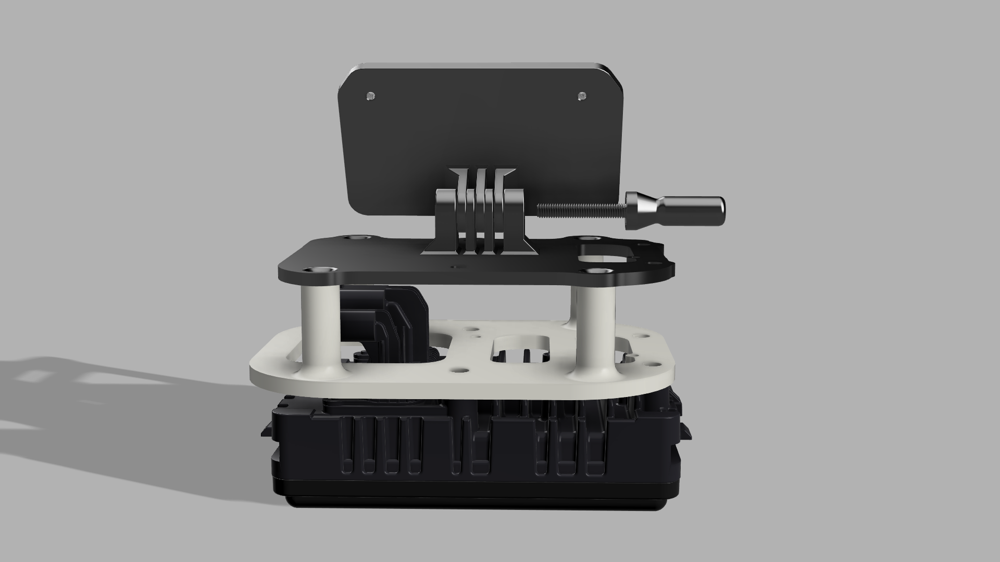
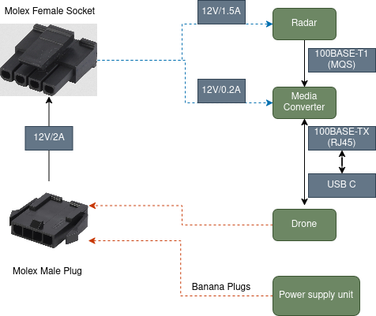

*UAV platform · custom radar bracket · full wiring diagram*
</div>

---

## Quick Start

```bash
# Build
source /opt/ros/humble/setup.bash
colcon build --symlink-install && source install/setup.bash

# Run (with a bag file)
ros2 launch temporal_radar_mapping radar_mapping.launch.py use_sim_time:=true launch_rviz:=true
ros2 bag play /path/to/bag.mcap --clock

# Save map
ros2 service call /save_map std_srvs/srv/Trigger "{}"
```

**Prerequisites**: ROS 2 Humble, PCL, Eigen, tf2

---

## Packages

| Package | Role |
|---|---|
| `fused_odometry` | IMU + Doppler + height fusion, GICP SLAM |
| `temporal_radar_mapping` | Bayesian occupancy grid, map saver |
| `radar_messages` | Custom ROS 2 message definitions |

All config in `src/<package>/config/`. Default: 7 cm resolution, 4 s decay delay.

---

## Evaluation

```bash
./eval/09_run_experiments.sh   # full suite — ~50 min, generates all figures
python3 eval/02_plot_trajectory.py --data eval/data --out eval/figures
python3 eval/04_plot_performance.py --data eval/data --out eval/figures
python3 eval/08_enhance_map.py --map eval/maps/baseline.pgm --simple
```

---

*Kartik Dangi*
